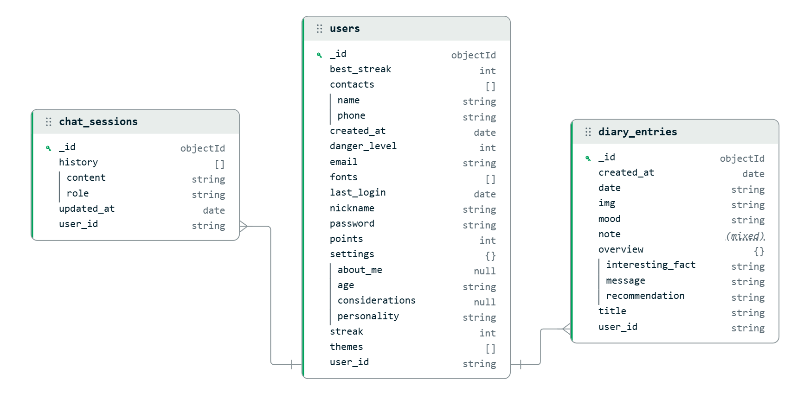

# API Mr. Zorro

Backend desarrollado en Python con FastAPI para la aplicación móvil Mr. Zorro. Esta API funciona como un acompañante emocional que procesa entradas de diario, analiza imágenes usando IA y genera recomendaciones personalizadas con sistema de autenticación y streak de usuarios.

## 🚀 Características

- **Sistema de Usuarios**: Registro, login y gestión de streak diario
- **Sistema de Puntos**: Recompensas por actividades del diario (5 puntos por entrada)
- **Procesamiento de imágenes**: Clasificación automática usando ResNet-50 pre-entrenado (CPU-optimizado)
- **IA Generativa**: Integración con Google Gemini AI para recomendaciones personalizadas
- **Asistente de Voz**: Procesamiento de audio con Whisper (STT) y gTTS (TTS) para interacción por voz
- **Base de datos MongoDB**: Almacenamiento escalable con Beanie ODM
- **API RESTful**: Endpoints completos para gestión de diario con autenticación
- **Sistema de Streak**: Seguimiento de días consecutivos de login
- **Containerización**: Despliegue con Docker y Docker Compose

## 📋 Requisitos

### Para Desarrollo con Docker (Recomendado)
- Docker Desktop
- Docker Compose
- Git
- Google Gemini API Key

### Para Desarrollo Local
- Python 3.11+
- MongoDB (local o remoto)
- Google Gemini API Key
- FFmpeg (requerido para procesamiento de audio)

## 🚀 Instalación y Ejecución

### Opción 1: Docker (Recomendado)

1. **Clona el repositorio:**
```bash
git clone https://github.com/jorgemp1270/mrzorro_api.git
cd mrzorro_api
```

2. **Configura las variables de entorno:**
Crea un archivo `.env` en el directorio raíz:
```env
GEMINI_API_KEY=tu_api_key_de_gemini_aqui
MONGODB_URL=mongodb://mongo:27017
DATABASE_NAME=mrzorro_db
```

3. **Construye y ejecuta con Docker Compose:**
```bash
# Construir y ejecutar en segundo plano
docker-compose up --build -d

# Ver logs en tiempo real
docker-compose logs -f app

# Verificar que los servicios estén corriendo
docker-compose ps
```

4. **La API estará disponible en:**
- **API**: http://localhost:8000
- **Documentación interactiva**: http://localhost:8000/docs
- **MongoDB**: localhost:27017

5. **Para detener los servicios:**
```bash
# Detener servicios
docker-compose down

# Detener y eliminar volúmenes (⚠️ elimina datos)
docker-compose down -v
```

### Opción 2: Desarrollo Local

1. **Clona el repositorio:**
```bash
git clone https://github.com/jorgemp1270/mrzorro_api.git
cd mrzorro_api
```

2. **Instala MongoDB localmente o usa Docker:**
```bash
# Con Docker
docker run -d -p 27017:27017 --name mongodb mongo:7.0

# O instalar MongoDB localmente desde https://www.mongodb.com/try/download/community
```

3. **Crea un entorno virtual e instala dependencias:**
```bash
python -m venv venv
source venv/bin/activate  # En Windows: venv\Scripts\activate
pip install -r requirements.txt
```

4. **Configura las variables de entorno:**
```env
GEMINI_API_KEY=tu_api_key_de_gemini_aqui
MONGODB_URL=mongodb://localhost:27017
DATABASE_NAME=mrzorro_db
```

5. **Ejecuta la aplicación:**
```bash
uvicorn app.main:app --reload --host 0.0.0.0 --port 8000
```

## 📁 Estructura del Proyecto

```
backend/
├── app/
│   ├── main.py          # Aplicación principal FastAPI
│   ├── schemas.py       # Modelos Pydantic para validación
│   ├── models.py        # Modelos MongoDB con Beanie
│   └── database.py      # Configuración de conexión MongoDB
├── models/
│   └── resnet50/        # Modelo ResNet-50 y archivos relacionados
│       ├── resnet50-0676ba61.pth
│       └── imagenet_class_index.json
├── scripts/
│   └── migrate_data.py  # Script de migración de datos TinyDB → MongoDB
├── .env                 # Variables de entorno (no versionado)
├── .dockerignore        # Archivos excluidos del contexto Docker
├── Dockerfile           # Configuración de imagen Docker
├── docker-compose.yml   # Orquestación de servicios
├── init-mongo.js        # Script de inicialización MongoDB
├── requirements.txt     # Dependencias Python
└── README.md           # Este archivo
```

## 🔧 Endpoints de la API

### 🔐 Autenticación de Usuarios

#### 1. Registrar nuevo usuario
- **URL**: `/signup`
- **Método**: `POST`
- **Descripción**: Registra un nuevo usuario en el sistema
- **Cuerpo de la petición**:
```json
{
    "email": "usuario@email.com",
    "password": "contraseña123",
    "nickname": "MiApodo"
}
```
- **Respuesta exitosa**:
```json
{
    "message": "Usuario creado exitosamente",
    "user": "user_20251120143059_1234"
}
```

#### 2. Iniciar sesión
- **URL**: `/login`
- **Método**: `POST`
- **Descripción**: Inicia sesión y actualiza el streak del usuario
- **Cuerpo de la petición**:
```json
{
    "email": "usuario@email.com",
    "password": "contraseña123"
}
```
- **Respuesta exitosa**:
```json
{
    "message": "Inicio de sesión exitoso",
    "user": {
        "user": "user_20251120143059_1234",
        "nickname": "MiApodo",
        "streak": 5,
        "best_streak": 10,
        "points": 45
    }
}
```

### 📚 Gestión de Diario

#### 3. Información de la API
- **URL**: `/`
- **Método**: `GET`
- **Descripción**: Retorna información básica de la aplicación
- **Respuesta**:
```json
{
    "app": "Mr.Zorro",
    "version": "1.0.0",
    "description": "API para la app Mr.Zorro"
}
```

#### 4. Obtener entradas del diario por usuario
- **URL**: `/diary/{user}`
- **Método**: `GET`
- **Descripción**: Obtiene todas las entradas del diario para un usuario específico
- **Parámetros**:
  - `user` (string): ID único del usuario
- **Respuesta**: Array de entradas del diario del usuario

#### 5. Agregar nueva entrada al diario
- **URL**: `/diary`
- **Método**: `POST`
- **Descripción**: Agrega una nueva entrada al diario con procesamiento de IA
- **Cuerpo de la petición**:
```json
{
    "user": "user_20251120143059_1234",
    "mood": "feliz",
    "title": "Mi día especial",
    "note": "Mi nota del día (opcional)",
    "img": "imagen_en_base64 (opcional)"
}
```
- **Respuesta exitosa (nueva entrada)**:
```json
{
    "message": "Entrada agregada exitosamente",
    "points_earned": 5,
    "total_points": 25
}
```

### 🖼️ Procesamiento de Imágenes

#### 6. Actualizar imagen en entrada existente
- **URL**: `/update-image`
- **Método**: `POST`
- **Descripción**: Actualiza la imagen en una entrada existente y regenera recomendación IA

#### 7. Predecir etiqueta de imagen
- **URL**: `/predict-image`
- **Método**: `POST`
- **Descripción**: Clasifica una imagen usando ResNet-50 y proporciona contexto del diario

### 🤖 IA Generativa

#### 8. Generar respuesta personalizada
- **URL**: `/prompt`
- **Método**: `POST`
- **Descripción**: Genera respuesta usando Gemini AI basada en prompt y entradas de la semana

### 🛍️ Tienda y Puntos

#### 9. Realizar compra
- **URL**: `/make-purchase`
- **Método**: `POST`
- **Descripción**: Procesa una compra de tema o fuente usando los puntos del usuario.
- **Cuerpo de la petición**:
```json
{
    "user": "user_20251117203959_8322",
    "price": "50",
    "theme": "dark_mode"
}
```
- **Campos**:
  - `user` (string, requerido): ID único del usuario
  - `price` (string o int, requerido): Costo del ítem en puntos
  - `theme` (string, opcional): Identificador del tema comprado
  - `font` (string, opcional): Identificador de la fuente comprada
  - *Nota*: Se debe especificar `theme` O `font`, pero no ambos.
- **Respuesta exitosa**:
```json
{
    "message": "Compra exitosa",
    "remaining_points": 150
}
```

### 🎤 Asistente de Voz

#### 10. Enviar audio (Chunks)
- **URL**: `/audio`
- **Método**: `POST`
- **Descripción**: Recibe chunks de audio desde el ESP32, los procesa y retorna una respuesta de audio.
- **Headers**:
  - `X-Chunk-Number`: Número de secuencia del chunk (int)
  - `X-Last-Chunk`: "true" si es el último chunk, "false" si no (string)
  - `X-User-Id`: ID del usuario (string, **REQUERIDO**)
- **Body**: Datos binarios del audio (raw bytes)
- **Respuesta (Chunk intermedio)**:
```json
{
    "status": "ok",
    "chunk": 1
}
```
- **Respuesta (Último chunk - Procesamiento completo)**:
```json
{
    "status": "ok",
    "user_text": "Texto transcrito del usuario",
    "ai_response": "Respuesta de texto de Gemini",
    "filename": "output_user123_20251122_120000.wav"
}
```

#### 11. Obtener archivo de respuesta
- **URL**: `/get_response/{filename}`
- **Método**: `GET`
- **Descripción**: Descarga el archivo de audio generado (WAV) para reproducción.
- **Parámetros**:
  - `filename`: Nombre del archivo retornado por `/audio`

#### 12. Obtener última respuesta
- **URL**: `/last_response`
- **Método**: `GET`
- **Descripción**: Obtiene el nombre del último archivo de audio generado.

## 🛠️ Gestión y Monitoreo

### Ver Datos en MongoDB
```bash
# Conectar a MongoDB
docker exec -it mrzorro-mongo mongosh

# Usar base de datos
use mrzorro_db

# Ver usuarios
db.users.find().pretty()

# Ver entradas de diario
db.diary_entries.find().pretty()

# Contar documentos
db.users.countDocuments()
db.diary_entries.countDocuments()
```

### Logs de la Aplicación
```bash
# Ver logs de la aplicación
docker-compose logs -f app

# Ver logs de MongoDB
docker-compose logs -f mongo

# Ver todos los logs
docker-compose logs -f
```

### Migración de Datos TinyDB → MongoDB
Si tienes datos existentes en TinyDB, puedes migrarlos:
```bash
# Asegúrate de que MongoDB esté corriendo
docker-compose up -d mongo

# Ejecutar script de migración
python scripts/migrate_data.py
```

### 4. Obtener entradas del diario por usuario
- **URL**: `/diary/{user}`
- **Método**: `GET`
- **Descripción**: Obtiene todas las entradas del diario para un usuario específico
- **Parámetros**:
  - `user` (string): ID único del usuario
- **Respuesta**: Array de entradas del diario del usuario
```json
[
    {
        "user": "user_20251117203959_8322",
        "date": "2025-11-15",
        "overview": {
            "message": "Mensaje motivador",
            "recommendation": "Recomendación personalizada",
            "interesting_fact": "Dato curioso del día"
        },
        "mood": "feliz",
        "title": "Mi día especial",
        "note": "Nota del usuario",
        "img": "etiqueta_imagen"
    }
]
```

### 5. Obtener entrada por usuario y fecha
- **URL**: `/diary/{user}/{date}`
- **Método**: `GET`
- **Descripción**: Obtiene las entradas del diario para un usuario y fecha específica
- **Parámetros**:
  - `user` (string): ID único del usuario
  - `date` (string): Fecha en formato YYYY-MM-DD
- **Respuesta exitosa**: Array de entradas para la fecha especificada
- **Respuesta error (404)**:
```json
{
    "error": "No se encontraron datos para la fecha especificada"
}
```
- **Respuesta error (404) si usuario no existe**:
```json
{
    "detail": "Usuario no encontrado"
}
```

### 6. Agregar nueva entrada al diario
- **URL**: `/diary`
- **Método**: `POST`
- **Descripción**: Agrega una nueva entrada al diario con procesamiento de IA
- **Cuerpo de la petición**:
```json
{
    "user": "user_20251117203959_8322",
    "mood": "feliz",
    "title": "Mi día especial",
    "note": "Mi nota del día (opcional)",
    "img": "imagen_en_base64 (opcional)"
}
```
- **Campos**:
  - `user` (string, requerido): ID único del usuario
  - `mood` (string, requerido): Estado de ánimo del usuario
  - `title` (string, opcional): Título del día
  - `note` (string, opcional): Nota personal del usuario
  - `img` (string, opcional): Imagen codificada en base64
- **Respuesta exitosa (nueva entrada)**:
```json
{
    "message": "Entrada agregada exitosamente",
    "points_earned": 5,
    "total_points": 25
}
```
- **Si ya existe entrada para la fecha**:
```json
{
    "message": "Entrada actualizada exitosamente"
}
```

### 7. Actualizar imagen en entrada existente
- **URL**: `/update-image`
- **Método**: `POST`
- **Descripción**: Analiza una imagen y actualiza la entrada del diario correspondiente con nueva IA
- **Cuerpo de la petición**:
```json
{
    "user": "user_20251117203959_8322",
    "date": "2025-11-15",
    "img": "imagen_en_base64"
}
```
- **Campos**:
  - `user` (string, requerido): ID único del usuario
  - `date` (string, requerido): Fecha en formato YYYY-MM-DD
  - `img` (string, requerido): Imagen codificada en base64
- **Respuesta exitosa**:
```json
{
    "date": "2025-11-15",
    "predicted_label": "etiqueta_predicha"
}
```
- **Respuesta error (400)**:
```json
{
    "detail": "Imagen/fecha inválida o error en predicción"
}
```
- **Respuesta error (404)**:
```json
{
    "detail": "No se encontró entrada para la fecha especificada"
}
```

### 8. Predecir etiqueta de imagen independiente
- **URL**: `/predict-image`
- **Método**: `POST`
- **Descripción**: Predice la etiqueta de una imagen sin actualizar ningún diario
- **Cuerpo de la petición**:
```json
{
    "user": "user_20251117203959_8322",
    "img": "imagen_en_base64"
}
```
- **Campos**:
  - `user` (string, requerido): ID único del usuario
  - `img` (string, requerido): Imagen codificada en base64
- **Respuesta exitosa**:
```json
{
    "predicted_label": "etiqueta_predicha",
    "diary_context": {
        "recent_entries": [...],
        "ai_description": "Descripción generada por IA basada en entradas recientes"
    }
}
```

### 9. Generar respuesta con prompt personalizado
- **URL**: `/prompt`
- **Método**: `POST`
- **Descripción**: Genera una respuesta personalizada usando IA basada en las entradas del diario de la semana actual del usuario
- **Cuerpo de la petición**:
```json
{
    "user": "user_20251117203959_8322",
    "prompt": "¿Cómo estuvo mi semana?"
}
```
- **Campos**:
  - `user` (string, requerido): ID único del usuario
  - `prompt` (string, requerido): Pregunta o prompt del usuario
- **Funcionalidad**:
  - Analiza las entradas del diario de la semana actual (desde el lunes) del usuario específico
  - Envía solo los campos `mood`, `note` e `img` a la IA
  - Genera una respuesta motivadora y personalizada
- **Respuesta exitosa**:
```json
{
    "response": "Respuesta motivadora basada en tu semana..."
}
```
- **Respuesta error (400)**:
```json
{
    "detail": "Error en generación de respuesta"
}
```

## 📊 Base de Datos

La aplicación utiliza MongoDB como base de datos principal con las siguientes colecciones:

### **Colección: users**
- **Usuarios registrados** con credenciales, streak y sistema de puntos
- **Campos**: `user_id` (ID único), `email`, `password`, `nickname`, `last_login`, `streak`, `best_streak`, `points`, `created_at`
- **Indexes**: `user_id` (único), `email` (único)

### **Colección: diary_entries**
- **Entradas diarias** filtradas por usuario con fecha como identificador
- **Estados de ánimo, notas y títulos** del usuario
- **Etiquetas de imágenes** procesadas por ResNet-50
- **Respuestas generadas por IA** (overview con mensaje, recomendación y dato curioso)
- **Indexes**: `user_id + date` (compuesto único), `user_id`, `date`

<p align="center">
  
</p>

## 🤖 Integración con IA

### **Google Gemini AI (gemini-2.5-flash)**
La API utiliza Google Gemini AI para generar:
- **Mensajes motivadores personalizados** basados en el estado de ánimo
- **Recomendaciones diarias** adaptadas al contexto del usuario
- **Datos curiosos** relacionados con las actividades del día
- **Respuestas a prompts personalizados** analizando las entradas de la semana

### **ResNet-50 para Clasificación de Imágenes**
- Modelo pre-entrenado en ImageNet con 1000 clases (CPU optimizado)
- Clasifica imágenes automáticamente cuando se suben al diario
- Las etiquetas predichas se integran en las recomendaciones de IA
- Procesa imágenes en formato base64

### **Procesamiento de Voz**
- **Whisper (OpenAI)**: Modelo "base" para transcripción de voz a texto (STT) en español.
- **gTTS (Google Text-to-Speech)**: Síntesis de voz para generar respuestas audibles.
- **FFmpeg**: Conversión de formatos de audio para compatibilidad con ESP32.

## 🔧 Desarrollo

### **Stack Tecnológico**
- **Backend**: FastAPI (Python 3.11+)
- **Base de Datos**: MongoDB con Beanie ODM
- **IA**: Google Gemini AI + PyTorch (ResNet-50) + Whisper
- **Audio**: gTTS + FFmpeg
- **Containerización**: Docker + Docker Compose
- **Image Processing**: Pillow + Torchvision

### **Ejecutar en modo desarrollo**
```bash
# Con auto-reload
uvicorn app.main:app --reload --host 0.0.0.0 --port 8000

# Solo contenedor de MongoDB
docker-compose up -d mongo
```

### **Variables de Entorno**
```env
GEMINI_API_KEY=tu_api_key_de_gemini
MONGODB_URL=mongodb://localhost:27017  # Para desarrollo local
DATABASE_NAME=mrzorro_db
```

## 📝 Notas Importantes

- La API procesa imágenes en formato base64
- Las fechas deben estar en formato ISO (YYYY-MM-DD)
- Las respuestas de IA están limitadas a 100 palabras
- MongoDB se inicializa automáticamente con índices en el primer arranque
- Todos los endpoints con `user` validan la existencia del usuario
- **Sistema de Puntos**: Se otorgan 5 puntos por cada nueva entrada de diario
- **Sistema de Streak**: Login diario incrementa streak, >24h lo resetea

## 🧪 Testing

### **Probar API con curl**
```bash
# Health check
curl http://localhost:8000

# Registro de usuario
curl -X POST "http://localhost:8000/signup" \
  -H "Content-Type: application/json" \
  -d '{"email": "test@test.com", "password": "password123", "nickname": "Test"}'

# Login
curl -X POST "http://localhost:8000/login" \
  -H "Content-Type: application/json" \
  -d '{"email": "test@test.com", "password": "password123"}'
```

### **Documentación Interactiva**
- **Swagger UI**: http://localhost:8000/docs
- **ReDoc**: http://localhost:8000/redoc

## 🔐 Seguridad

- Mantén tu `GEMINI_API_KEY` segura en el archivo `.env`
- No subas el archivo `.env` al control de versiones
- Para producción, usa variables de entorno del sistema o secrets de Docker/Kubernetes

---

**Desarrollado con ❤️ usando FastAPI, MongoDB, y Docker**